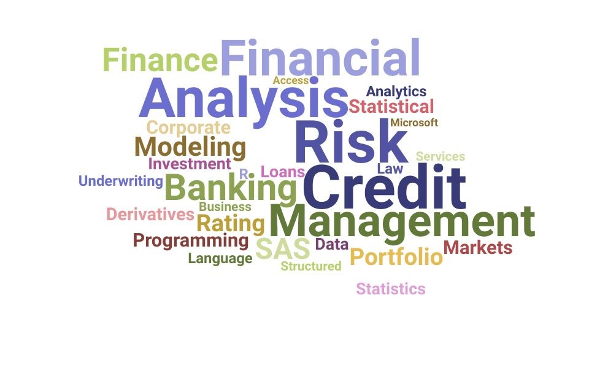
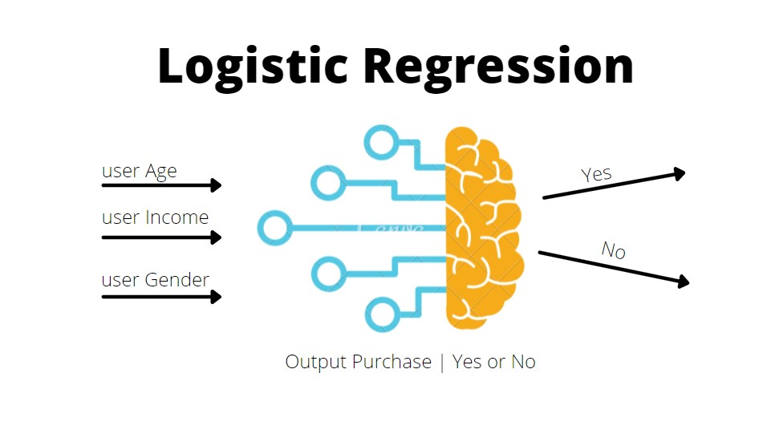
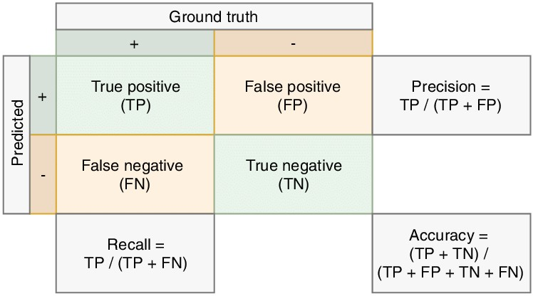

# Credit Risk Classification Project

## Project Overview

The **Credit Risk Classification Project** 
Leverages machine learning to predict the risk level associated with loan applicants.
The purpose of this analysis is to assess the risk of loan applicants by predicting their likelihood of defaulting on a loan. Using historical data on loan amounts, interest rates, and borrower financial information, we aim to classify loans as either "healthy" (low risk) or "high-risk." 
This classification will support financial institutions in making informed lending decisions, minimizing potential financial losses from high-risk loans, and promoting responsible lending practices.
By employing a logistic regression model, we can evaluate key metrics such as accuracy, precision, and recall, determining the model's effectiveness in distinguishing between high- and low-risk loans.
Ultimately, this analysis provides a foundation for recommending the model's use in practical credit risk management, ensuring better loan portfolio quality and risk mitigation.

## Objectives

1. **Develop a Predictive Model for Credit Risk**  
   - Use machine learning techniques to predict credit risk levels based on applicant characteristics.
   - Train the model on historical loan data to identify key factors contributing to loan default risk.

2. **Support Financial Decision-Making**  
   - Provide a tool that allows financial institutions to assess loan applicants effectively.
   - Reduce default rates and strengthen loan portfolios by accurately identifying high-risk applicants.

## Dataset

The dataset (`lending_data.csv`) includes information about loan applicants, such as loan size, interest rate, borrower income, debt-to-income ratio, and credit history. Key features include:

- **Loan Size**: Amount of the loan requested by the applicant.
- **Interest Rate**: The interest rate for the loan.
- **Borrower Income**: Applicant’s income.
- **Debt-to-Income Ratio**: Ratio of debt payments to income.
- **Credit History**: Reflects the applicant’s previous borrowing behavior.
- **Risk Level**: Target variable, indicating if the applicant is a high or low credit risk.

## Workflow and Methodology

1. **Data Preparation**  
   - Clean the dataset to remove any missing or anomalous values.
   - Normalize features to improve model accuracy and efficiency.

2. **Model Selection and Training**  
   - Experiment with various algorithms, such as Logistic Regression, Decision Trees, and Random Forests.
   - Evaluate each model based on performance metrics like accuracy, precision, recall, and F1 score to identify the best approach.

3. **Testing and Validation**  
   - Split the dataset into training and testing sets.
   - Use the testing set to validate the model's performance and ensure it generalizes well to new data.

4. **Deployment and Integration**  
   - Once finalized, the model can be integrated into financial applications to provide real-time credit risk assessments, helping lenders make informed decisions.

## Key Files

- **`credit_risk_classification.ipynb`**: Jupyter Notebook containing the code for data preparation, model training, evaluation, and predictions.
- **`lending_data.csv`**: The dataset with applicant information and risk levels used for training and testing the model.

## Model Performance Analysis for Healthy and High-Risk Loans

This classification report provides a solid assessment of the model's performance, breaking down the metrics for each label (0 for healthy loans and 1 for high-risk loans) and offering insights into its overall accuracy. Let’s examine each part of the report:

#### 1. Class 0 (Healthy Loans)

Precision: 1.00 – The model has perfect precision for healthy loans, meaning every loan predicted as healthy (0) is indeed a healthy loan. There are no false positives for this class.
Recall: 0.99 – The model captures 99% of the actual healthy loans. This high recall indicates that very few healthy loans are mistakenly classified as high-risk.
F1-Score: 1.00 – The perfect F1-score reflects the balance between high precision and recall, showing the model’s excellent performance in predicting healthy loans.

#### 2. Class 1 (High-Risk Loans)
Precision: 0.86 – For high-risk loans, the precision is 86%, meaning 86% of the loans predicted as high-risk are actually high-risk. There’s a slight trade-off here, as a small percentage of healthy loans might be mistakenly labeled as high-risk.
Recall: 0.94 – The model correctly identifies 94% of actual high-risk loans, which is very good and suggests it effectively flags the majority of risky loans.
F1-Score: 0.90 – The F1-score is high but slightly lower than for class 0, indicating a strong, though not perfect, balance between precision and recall for high-risk loans.

#### 3. Overall Performance
Accuracy: 0.99 – With 99% overall accuracy, the model performs exceptionally well on this dataset, correctly classifying the vast majority of loans.
Macro Average: Precision, recall, and F1-score averages across both classes are high, showing that the model handles both healthy and high-risk loans effectively, though slightly favoring the prediction of healthy loans due to the class imbalance.
Weighted Average: With a weighted F1-score of 0.99, the model’s high performance is robust, considering both classes' contribution proportionally.

### *Summary*
The model is very effective in predicting both healthy and high-risk loans. It’s especially accurate for healthy loans, but also does well with high-risk loans, maintaining a high recall rate (0.94) to capture most high-risk cases. However, some healthy loans might be flagged as high-risk, reflected in the slightly lower precision for class 1.
